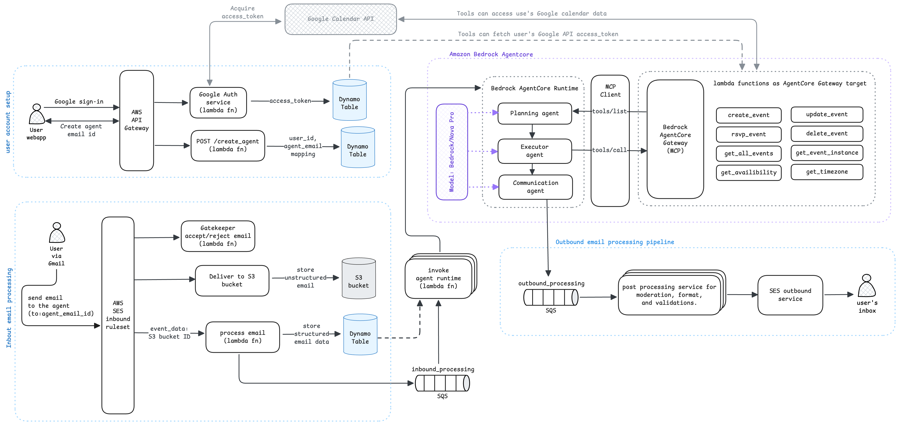

# Superagent

**Your AI-Powered Executive Assistant for Calendar Management**

[](https://superagent.diy)
[](LICENSE)

## What is Superagent?

Superagent manages your calendar with the finesse of a world-class Executive Assistant. It works around the clock, seamlessly adapting to your schedule and time zone — ensuring your calendar stays clean and your day runs smoothly.

### Key Features

- **Natural Language Processing**: Ask Superagent in plain English
  - "Setup an on-site interview for this candidate"
  - "I'm not feeling well today, please clear my day"
  - "How's my day looking?"
- **24/7 Availability**: Your personal EA that resides in your inbox
- **Google Calendar Integration**: Seamless sync with your existing calendar
- **Email-Based Interface**: Simple email communication with your AI assistant

## How It Works

1. **Sign Up**: Create an account on the website
2. **Link Calendar**: Connect your Google Calendar
3. **Generate Agent**: Get a personalized email address for your EA agent
4. **Save Contact**: Add the agent email to your Google contacts for easy access
5. **Start Using**: Send emails to your agent and receive immediate responses

## Architecture Overview

Superagent is built on a serverless, event-driven architecture leveraging AWS services and Amazon Bedrock AgentCore. The system consists of four main pipelines:



### 1. User Account Setup Pipeline
- **User Webapp**: React.js frontend for user registration and agent creation
- **Google Authentication**: Secure OAuth integration with Google Calendar API
- **Agent Creation**: Generates dedicated email addresses for each user's EA agent
- **Data Storage**: Stores access tokens and user-agent mappings in DynamoDB

### 2. Inbound Email Processing Pipeline
- **Email Reception**: AWS SES receives emails sent to agent addresses
- **Email Processing**: Converts unstructured emails to structured data
- **Queue Management**: SQS queues manage email processing workflow
- **Agent Invocation**: Triggers the Amazon Bedrock AgentCore AI agent runtime

### 3. Amazon Bedrock AgentCore (Core Intelligence)
- **Multi-Agent System**: Three specialized agents working together:
  - **Planning Agent**: Understands requests and creates execution plans
  - **Executor Agent**: Executes planned actions using available tools
  - **Communication Agent**: Formulates responses to users
- **Tool Integration**: Lambda functions serve as tools for calendar operations via Bedrock AgentCore Gateway
- **LLM Integration**: Powered by Amazon Bedrock/Nova Pro LLM model for natural language understanding and reasoning

### 4. Outbound Email Processing Pipeline
- **Response Generation**: AI agents generate contextual responses
- **Content Moderation**: Ensures appropriate and well-formatted responses
- **Email Delivery**: Sends responses back to users via SES

## Project Structure

This repository contains three main components working together as one integrated product:

```
├── website/                # React.js Frontend
├── agent-core/             # Amazon Bedrock AgentCore Runtime
├── serverless-backend/     # AWS Lambda Functions & Serverless Framework
└── doc/                    # Documentation and Architecture Diagrams
```

### 1. Website (`/website`)
**React.js Frontend Application**

- **Purpose**: User interface for sign-up, authentication, and agent management
- **Tech Stack**: React, TypeScript, Tailwind CSS
- **Key Features**:
  - Google OAuth integration
  - User dashboard for agent management
  - Responsive design for all devices

**Setup:**
```bash
cd website
npm install
npm start
```

### 2. Agent Core (`/agent-core`)
**Amazon Bedrock AgentCore Runtime**

- **Purpose**: Multi-agent AI system for executive assistance
- **Tech Stack**: Python, Amazon Bedrock AgentCore
- **Components**:
  - **Planning Agent**: Breaks down user requests into actionable steps
  - **Executor Agent**: Executes calendar operations using available tools
  - **Communication Agent**: Handles email responses and user communication
- **Tools**: Integration with calendar management functions

**Setup:**
For detailed setup instructions, please refer to the official AWS Bedrock AgentCore documentation:
[Get started with Amazon Bedrock AgentCore](https://docs.aws.amazon.com/bedrock-agentcore/latest/devguide/agentcore-get-started-toolkit.html)

### 3. Serverless Backend (`/serverless-backend`)
**AWS Lambda Functions & Serverless Framework**

- **Purpose**: Backend services and tool functions for the AI agents
- **Tech Stack**: Python, AWS Lambda, Serverless Framework
- **Key Services**:
  - **Authentication**: Google OAuth and user management
  - **Calendar Tools**: Functions for calendar operations (create, update, delete events)
  - **Email Processing**: Inbound and outbound email handling
  - **API Gateway**: RESTful endpoints for frontend communication

**API Endpoints:**
- `GET /v1/health` - Health check endpoint
- `POST /v1/validateGoogleAuth` - Validate Google OAuth authentication
- `POST /v1/validateInvite` - Validate user invite codes
- `POST /v1/getAgentEmail` - Retrieve user's assigned agent email

**Available Calendar Tools (Internal Functions):**
- `calendar_createEvent` - Create new calendar events
- `calendar_updateEvent` - Modify existing events
- `calendar_deleteEvent` - Remove events from calendar
- `calendar_getAllEvents` - Retrieve user's calendar events
- `calendar_getEventInstances` - Get specific event instances
- `calendar_getAvailability` - Check user's availability
- `calendar_rsvpEvent` - Respond to event invitations
- `calendar_getTimezone` - Handle timezone operations

**Setup:**
```bash
cd serverless-backend
npm install -g serverless
pip install -r requirements.txt
serverless deploy
```

## Getting Started

### Prerequisites
- Node.js (v16 or higher)
- Python (v3.8 or higher)
- AWS CLI configured
- Google Cloud Console project with Calendar API enabled

### Quick Start

1. **Clone the repository**
   ```bash
   git clone <repository-url>
   cd aws-ai-2025
   ```

2. **Set up the backend**
   ```bash
   cd serverless-backend
   cp serverless-config.example.yml serverless-config.yml
   # Edit serverless-config.yml with your AWS and Google credentials
   serverless deploy
   ```

3. **Set up the frontend**
   ```bash
   cd website
   npm install
   npm start
   ```

4. **Set up the agent core**
   ```bash
   cd agent-core
   pip install -r requirements.txt
   # Configure agent settings
   ```

## Configuration

### Environment Variables
- `GOOGLE_CLIENT_ID`: Google OAuth client ID
- `GOOGLE_CLIENT_SECRET`: Google OAuth client secret
- `AWS_REGION`: AWS deployment region
- `BEDROCK_MODEL_ID`: Amazon Bedrock model identifier

### AWS Services Used
- **Lambda**: Serverless compute for backend functions
- **API Gateway**: RESTful API endpoints
- **DynamoDB**: User data and token storage
- **SES**: Email sending and receiving
- **SQS**: Message queuing for email processing
- **S3**: Email storage and processing
- **Bedrock**: AI/ML model hosting

## Contributing

1. Fork the repository
2. Create a feature branch (`git checkout -b feature/amazing-feature`)
3. Commit your changes (`git commit -m 'Add some amazing feature'`)
4. Push to the branch (`git push origin feature/amazing-feature`)
5. Open a Pull Request

## License

This project is licensed under the GNU AFFERO GENERAL PUBLIC LICENSE - see the [LICENSE](LICENSE) file for details.

## Support

For support and questions:
- Visit our website: [superagent.diy](https://superagent.diy)
- Check the documentation in the `/doc` folder
- Review the troubleshooting guide: [GOOGLE_OAUTH_TROUBLESHOOTING.md](GOOGLE_OAUTH_TROUBLESHOOTING.md)

## Roadmap

- [ ] Enhanced natural language understanding
- [ ] Multi-calendar support
- [ ] Advanced scheduling algorithms
- [ ] Integration with more calendar providers
- [ ] Mobile app development
- [ ] Voice command support

---

**Superagent** - Making calendar management effortless with AI-powered assistance.
